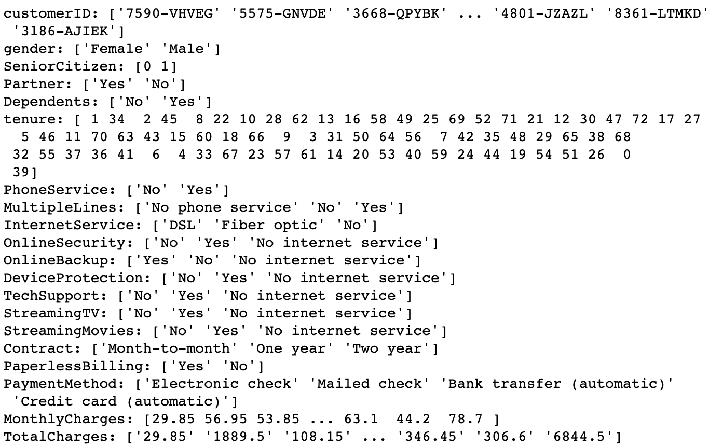

# Customer Churn Prediction
I developed, to my knowledge, the most accurate predictive model on Kaggle's [Telco Customer Churn](https://www.kaggle.com/blastchar/telco-customer-churn) dataset with a validation set prediction accuracy of `91.30`. Below I offer an executive summary entailing how I tackle this category of data science problems.  

## Our Features
Along with their corresponding possible values.  
  
---  
## The Target
  
---  
## The libraries
To install the requisite libraries run `conda env create -f environment.yml` from this repositories root directory to install all required libraries.  
The primary dependencies are [PyTorch](https://pytorch.org/docs/stable/index.html), [imblearn](https://imbalanced-learn.org/stable/introduction.html#introduction), [sklearn](https://scikit-learn.org/stable/), and [pandas](https://pandas.pydata.org/docs/reference/index.html).  

## The Model
  
---  
## The hyper-parameters
The loss function (criterion): `nn.BCEWithLogitsLoss()`.  
The optimizer and learning rate: `optim.Adam(deeper_model.parameters(), lr=1e-2)`.   
Validation set size: `20%`.  
The batch size: `827`.  
Instances of each class (after oversampling): `5174`.  
The number of epochs: `1000`. 

## Two custom functions
I wrote two custom functions `print_unique()` and `training_loop()`, both of which may be found in my notebook. *UPDATE* Since this repository's creation, `training_loop` has been significantly updated in my [custom_deep_learning](https://github.com/SpaceFrostDev/custom_deep_learning) repository.  

## "My Trick" to the most accurate model
If you've made it this far, take a peek inside my notebook. I'll give you a free cookie :) But, if you're in a rush, to summarize: The trick to achieving the highest accuracy out of any model on Kaggle, was to use [Adam](https://arxiv.org/abs/1412.6980) as my optimizer, which is more powerful than plain vanilla `optim.SGD`, to synthetically oversample the minority class [SMOTE](https://arxiv.org/abs/1106.1813), and use a neural network with sufficient capacity, which happened to be two layers. `nn.BatchNorm2d`, `nn.Dropout` and `nn.Embedding` are tricks which may be used to improve generalization with a model such as this but, I elected to not implement them here.